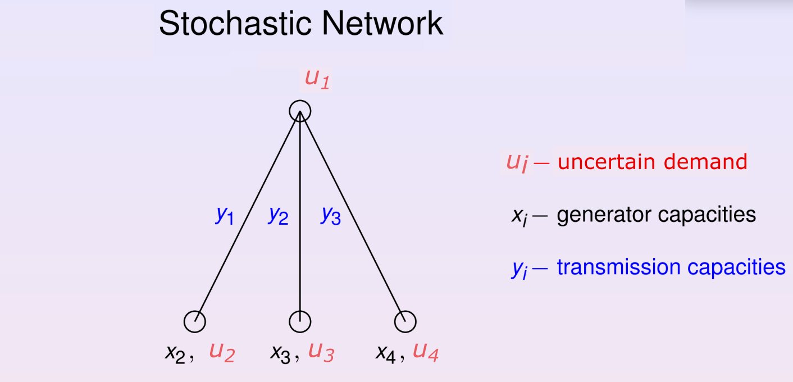

# Network Capacity Optimization Problem with Uncertain Loads

This project models a low-voltage distribution network optimization problem from the perspective of a Distribution System Operator (DSO). The goal is to design a cost-effective, safe, and robust grid expansion plan that connects residential demand points while accounting for the inherent uncertainty of distributed energy resources (DERs) like rooftop solar and micro-wind turbines.

## Problem statement

Plan an investment in 3 new cables and 3 generation units to supply 4 nodes / households.

